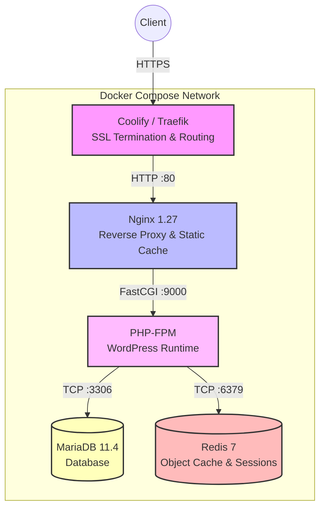

<div align="center">
  <h1>🚀 High-Performance WordPress Nginx Stack</h1>
  <p><strong>Production-grade Docker Compose stack for WordPress, tuned for Coolify & Traefik.</strong></p>
</div>

---

## 📑 Table of Contents

- [Overview](#-overview)
- [Key Features](#-key-features)
- [Architecture](#-architecture)
- [Performance Benchmarks](#-performance-benchmarks)
- [Requirements](#-requirements)
- [Quick Start](#-quick-start)
- [Deploy on Coolify](#-deploy-on-coolify)
- [WP-CLI Usage](#-wp-cli-usage)
- [Multi-PHP Version Switching](#-multi-php-version-switching)
- [Configuration Reference](#-configuration-reference)
- [FAQ](#-faq)
- [Troubleshooting](#-troubleshooting)
- [Credits](#-credits)

---

## 🔍 Overview

This repository provides a **production-grade Docker Compose stack** for deploying WordPress at scale. It is specifically designed for modern self-hosted PaaS platforms like **Coolify**, **Dokploy**, and **CapRover**, with built-in Traefik integration for automatic SSL, routing, and zero-downtime deployments.

Unlike basic WordPress Docker setups, this stack is **tuned for high traffic** (20k+ visits/day), supports **multi-PHP versioning** (from legacy 7.4 to bleeding-edge 8.5), and includes **WP-CLI**, **Redis Object Cache**, and **OPcache JIT** out of the box.

> 💡 **Looking for custom WordPress, DevOps, or AWS/GCP infrastructure?**
> Visit [se2code.com](https://www.se2code.com) for professional services.

---

## ⚡ Key Features

| Feature | Description |
| :--- | :--- |
| 🚀 **High Performance** | Tuned for 20,000+ daily visits with Redis Object Cache and OPcache JIT. |
| 🔄 **Multi-PHP Support** | Switch between PHP 7.4, 8.0, 8.1, 8.2, 8.3, 8.4, and 8.5 via `.env`. |
| 📦 **1GB File Uploads** | Fully configured for large file uploads (WooCommerce, backups, media). |
| 🛠️ **WP-CLI Integrated** | Manage WordPress from the command line without entering the main container. |
| 🔒 **Production Security** | Hardened Nginx, hidden headers, blocked PHP execution in uploads folder. |
| 🧠 **Smart Caching** | Redis for object cache + sessions, OPcache for PHP bytecode. |
| ⚙️ **Coolify Native** | Pre-configured Traefik labels for automatic HTTPS and routing. |
| 🗄️ **MariaDB 11** | Optimized InnoDB configuration specifically for WordPress workloads. |
| 🕒 **System Cron** | Replaces WP-Cron for reliable, predictable scheduled tasks. |
| 📊 **Health Checks** | Automatic service dependency ordering and recovery. |

---

## 🧱 Architecture



- **Web Server**: Nginx 1.27 (Alpine)
- **Runtime**: PHP-FPM 7.4 → 8.5 (Official WordPress base)
- **Database**: MariaDB 11.4 with `utf8mb4`
- **Cache**: Redis 7 (Alpine) with LRU eviction
- **CLI**: WP-CLI (Latest stable)
- **Orchestration**: Docker Compose v3.9

---

## 📊 Performance Benchmarks

Tested on a **4 vCPU / 8 GB RAM** VPS (Hetzner CX32):

| Metric | Value |
| :--- | :--- |
| **Daily visits supported** | 20,000 – 50,000 |
| **Peak requests/second** | 60 – 120 req/s |
| **Time to First Byte (TTFB)** | < 200ms (cached) |
| **PHP-FPM workers** | 80 max children |
| **OPcache hit ratio** | > 95% |
| **Redis memory usage** | ~150 MB (avg) |
| **MariaDB buffer pool** | 1 GB |

---

## 📋 Requirements

- **Docker Engine** 24.0+
- **Docker Compose** v2.20+
- **Coolify** (recommended) OR any Docker-compatible VPS
- **Minimum VPS specs**: 2 vCPU / 4 GB RAM (8 GB recommended for DB caching)
- **Domain name** pointing to your server IP

---

## 🚀 Quick Start

### 1. Clone the repository

```bash
git clone https://github.com/YOUR_USERNAME/wp-stack.git
cd wp-stack
```

### 2. Configure environment variables

Copy the example `.env` and edit it with your secure passwords:

```bash
cp .env-example .env
nano .env
```

> **Critical variables to change:**
> - `DOMAIN` → your domain (e.g., mysite.com)
> - `PHP_VERSION` → 7.4, 8.0, 8.1, 8.2, 8.3, 8.4, or 8.5
> - `DB_ROOT_PASSWORD`, `DB_PASSWORD`, `REDIS_PASSWORD` → Use strong random strings

### 3. Build and start the stack

```bash
docker compose up -d --build
```

### 4. Install WordPress via WP-CLI

Once the containers are healthy, you can install WordPress directly from the terminal:

```bash
docker compose run --rm wpcli core install \
  --url="https://yourdomain.com" \
  --title="My Awesome Site" \
  --admin_user="admin" \
  --admin_password="strongpassword" \
  --admin_email="admin@yourdomain.com"
```

### 5. Activate Redis Object Cache

Install the Redis Object Cache plugin from the WordPress admin and click **Enable**.

---

## ☁️ Deploy on Coolify

### Option A: Git-based deployment (Recommended)
1. Push this repository to your own GitHub, GitLab, or Gitea account.
2. In Coolify, click **New Resource** → **Git-based**.
3. Select your repository and branch.
4. Choose **Docker Compose** as the Build Pack.
5. Add all environment variables from your `.env` file in the Coolify UI.
6. Set the FQDN (e.g., `https://mysite.com`) in the Nginx service settings within Coolify if needed.
7. Click **Deploy**.

### Option B: Direct Docker Compose
1. In Coolify, click **New Resource** → **Docker Compose**.
2. Paste the contents of `docker-compose.yml`.
3. Add environment variables manually in the UI.
4. Click **Deploy**.

> 💡 **Pro tip:** Coolify will automatically provision Let's Encrypt SSL certificates via Traefik. No extra configuration is needed on your end.

---

## 🛠️ WP-CLI Usage

The `wpcli` service runs on-demand (not as a persistent container) to save system resources.

```bash
# Check WP-CLI info
docker compose run --rm wpcli --info

# List installed plugins
docker compose run --rm wpcli plugin list

# Update all plugins
docker compose run --rm wpcli plugin update --all

# Search and replace URLs (essential for migrations)
docker compose run --rm wpcli search-replace 'http://old.com' 'https://new.com'

# Regenerate thumbnails
docker compose run --rm wpcli media regenerate --yes

# Flush OPcache
docker compose run --rm wpcli cache flush

# Export database
docker compose run --rm wpcli db export - > backup.sql
```

---

## 🔄 Multi-PHP Version Switching

One of the standout features of this stack is the ability to switch PHP versions **without rebuilding from scratch**.

### Change PHP version

Edit your `.env` file and change the `PHP_VERSION` variable, then restart the stack:

```bash
docker compose up -d --build php
```

### Supported versions

| Version | Status | Notes |
| :--- | :--- | :--- |
| **PHP 7.4** | Legacy | End of life, use only for very old, unmaintained plugins |
| **PHP 8.0** | Stable | No JIT by default |
| **PHP 8.1** | Stable | Recommended for broad compatibility |
| **PHP 8.2** | Recommended | **Best balance of performance & stability** |
| **PHP 8.3** | Stable | Latest production-ready |
| **PHP 8.4** | Beta | Use with caution |
| **PHP 8.5** | Dev | Testing only |

---

## ⚙️ Configuration Reference

### Key files and their purpose

| File | Purpose |
| :--- | :--- |
| `docker-compose.yml` | Service orchestration and Traefik labels |
| `.env` | Environment variables (DO NOT commit to Git) |
| `Dockerfile.php` | Custom PHP-FPM image with compiled extensions |
| `Dockerfile.nginx` | Custom Nginx image |
| `config/php/php.ini` | PHP limits (1GB uploads, 1GB memory, JIT) |
| `config/php/www.conf` | PHP-FPM pool tuning (80 dynamic workers) |
| `config/php/opcache.ini` | OPcache + JIT configuration |
| `config/nginx/default.conf` | Nginx virtual host and security headers |
| `config/nginx/nginx.conf` | Nginx global settings and gzip tuning |
| `config/mariadb/custom.cnf` | MariaDB performance tuning (Buffer Pool, I/O) |
| `config/wp-cli/wp-cli.yml` | WP-CLI memory and path defaults |

### Critical PHP limits

These are pre-configured in `config/php/php.ini` to support heavy operations:

```ini
memory_limit        = 1024M
upload_max_filesize = 1024M
post_max_size       = 1100M
max_execution_time  = 600
max_input_vars      = 10000
```

---

## ❓ FAQ

### Is this stack suitable for WooCommerce?
**Yes.** The 1GB memory limit, Redis sessions, and MariaDB tuning make it ideal for medium-sized WooCommerce stores (up to ~500 daily orders).

### Can I use this with Elementor, Divi, or other page builders?
**Absolutely.** The `max_input_vars = 10000` setting prevents the common "Are you sure you want to do this?" error when saving complex pages.

### Does it support multisite?
**Yes.** After installing WordPress, you can enable multisite via WP-CLI:
```bash
docker compose run --rm wpcli core multisite-install --subdomains
```

### How do I backup the database?
```bash
# Export
docker compose run --rm wpcli db export - > backup_$(date +%F).sql

# Import
docker compose run --rm wpcli db import backup.sql
```
*For automated backups, Coolify supports scheduled backups natively, or you can integrate BorgBackup or Rclone to S3.*

### Why is WP-Cron disabled?
WordPress's built-in cron only runs when someone visits the site, causing unreliable scheduling and performance hits. This stack uses the Linux system cron (runs every minute in the PHP container) for precise, efficient task execution.

### Can I run this without Coolify?
Yes. Simply remove the `labels:` section from the Nginx service in `docker-compose.yml`, expose port `80` (and `443` if using an external cert resolver), and manage SSL with Certbot or Caddy externally.

---

## 🐛 Troubleshooting

| Problem | Solution |
| :--- | :--- |
| **502 Bad Gateway** | Check `docker compose logs php`. Usually a plugin memory issue or syntax error. |
| **413 Request Entity Too Large** | Verify `client_max_body_size` in `default.conf` matches `php.ini`. |
| **Error establishing database connection** | Wait 30s for MariaDB healthcheck. Check `.env` credentials. |
| **WP-CLI command not found** | Use `docker compose run --rm wpcli`, not `docker compose exec`. |
| **High RAM usage** | Lower `pm.max_children` in `www.conf` and `innodb_buffer_pool_size` in `custom.cnf`. |

---

## 🙌 Credits

Designed and engineered by **se2code**.

**se2code** is a specialized agency focused on WordPress development, high-performance server administration, AWS & GCP DevOps/SRE, and AI agent solutions. We help businesses scale their digital infrastructure with reliability and speed.

Special thanks to:
- [WordPress](https://wordpress.org/) – The world's most popular CMS
- [Coolify](https://coolify.io/) – The open-source Heroku alternative
- [Docker](https://www.docker.com/) – Containerization platform
- [WP-CLI](https://wp-cli.org/) – WordPress command-line tool

---

<div align="center">
  <strong>⭐ If this project helped you, consider giving it a star!</strong><br><br>
  <strong>Need professional help with WordPress, DevOps, or cloud infrastructure?</strong><br>
  👉 <a href="https://www.se2code.com/">Hire se2code</a>
</div>
